# databricks-ecommerce-pipeline
E-Commerce Analytics Platform — Databricks Medallion Architecture

## Project Overview
End-to-end data pipeline processing 183K+ e-commerce transactions
using Bronze → Silver → Gold Medallion Architecture on Databricks.

## Architecture
Raw CSV → Bronze (Delta) → Silver (cleaned) → Gold (business-ready)
                                                      ↓
                                              BI Dashboard + Genie

## Tech Stack
- Platform: Databricks, Delta Lake, Unity Catalog
- Language: Python, PySpark, SQL
- Features: Medallion Architecture, Vector Search, Databricks Genie

## Data Model
- Fact Table: order_items (183K+ records, multi-currency)
- Dimensions: products, customers, brands, categories, calendar

## Key Transformations
- Regex-based data cleansing
- Multi-currency normalization (INR/USD/GBP/AUD → INR)
- Derived KPIs: gross amount, discount, net sales
- Denormalized Gold view for BI consumption

## How to Run
1. Set up Databricks Free Edition
2. Run setup_catalog.ipynb first
3. Run dim/ notebooks in order (bronze → silver → gold)
4. Run fact/ notebooks in order (bronze → silver → gold)
5. Run denormalise_table_query.sql for the BI view
